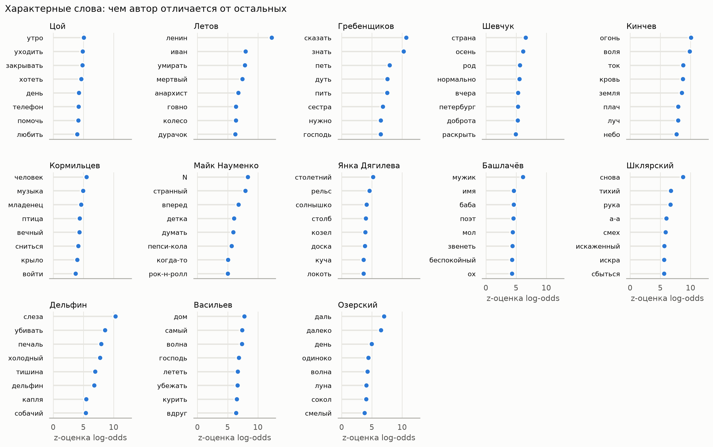
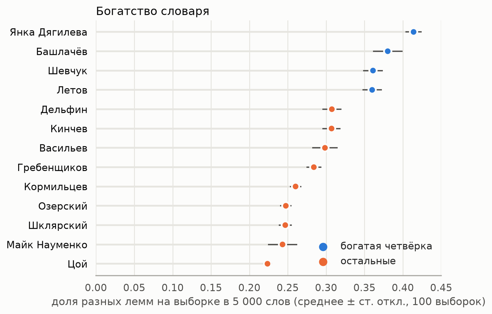
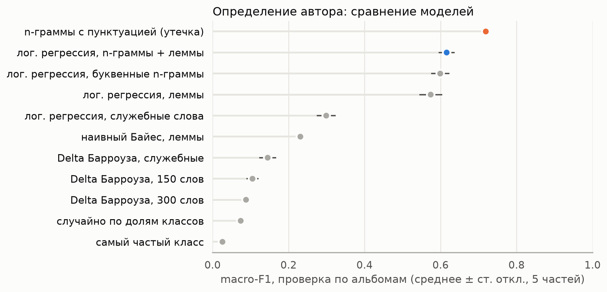
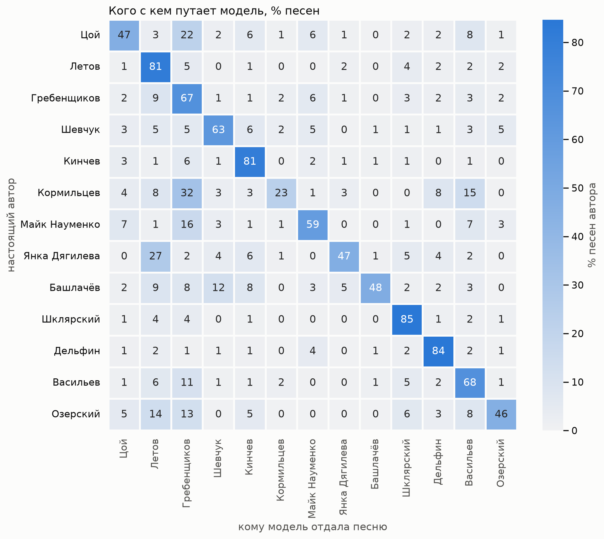

# rusrock

Словарь русского рока как задача NLP: частотные словари, характерные слова, богатство словаря и определение автора по тексту песни для тринадцати авторов — Виктор Цой, Егор Летов, Борис Гребенщиков, Юрий Шевчук, Константин Кинчев, Илья Кормильцев, Майк Науменко, Янка Дягилева, Александр Башлачёв, Эдмунд Шклярский, Андрей Лысиков (Дельфин), Александр Васильев («Сплин»), Дмитрий Озерский («Аукцыон»).

Рассказ о результатах для широкого читателя — статья [«Словно, будто и мёртвый»](https://telegra.ph/Slovno-budto-i-myortvyj-chto-chastotnyj-slovar-govorit-o-russkom-roke-09-28).

Класс — автор слов, а не группа: совместные тексты, переводы, народные песни и кавер-версии в классы не входят. Корпус — 2 189 песен, 290 тыс. словоупотреблений, 280 альбомов.

## Результаты

**Характерные слова** — log-odds с информативным априорным распределением Дирихле (Monroe, Colaresi, Quinn, 2008): чем лексика автора отличается от остальных.



**Богатство словаря** — доля разных лемм на выборках равного объёма (5 000 словоупотреблений), потому что по закону Хипса словарь растёт медленнее текста и длинные дискографии иначе проигрывают.



**Определение автора** — перекрёстная проверка по альбомам: все песни альбома целиком в обучении или целиком в тесте. Лучшая модель — логистическая регрессия на буквенных n-граммах и леммах, macro-F1 0,62, верный автор в 69% песен. Буквенные n-граммы на исходном тексте давали 0,72, но узнавали сайт-источник по «ё», тире и точке с запятой; для них текст сведён к буквам.





## Данные

Тексты песен защищены авторским правом и в репозитории отсутствуют (`data/` в `.gitignore`). Их можно собрать заново разборщиками из `src/rusrock/sites/`: они кэшируют страницы, выдерживают паузу между запросами, представляются своим User-Agent и соблюдают `robots.txt`. Сайты, закрытые для автоматических клиентов, не используются; поэтому у «Аукцыона» нет альбома «Сокровище» (2025).

В `meta/` — метаданные, собранные вручную и по Википедии: альбомы и годы, авторы слов, исключения (чужие тексты), даты текстов. У каждой таблицы в заголовке указан источник.

## Воспроизведение

Нужны [uv](https://docs.astral.sh/uv/) и Python 3.12+.

```sh
uv sync
# 1. сбор текстов (по одному модулю на источник)
uv run rusrock-scrape gro
uv run rusrock-scrape nau
for site in kino aquarium ddt alisa zoopark yanka piknik bashlachev delfin splin auktyon; do
  uv run python -m rusrock.sites.$site
done
# 2. корпус, разметка, словари, характерные слова
uv run python -m rusrock.build
uv run python -W ignore -m rusrock.preprocess
uv run python -m rusrock.freq
uv run python -m rusrock.keyness
# 3. богатство словаря, уникальные слова, определение автора, графики
uv run python -m rusrock.richness
uv run python -m rusrock.unique
uv run python -m rusrock.attribution
uv run python -m rusrock.figures
```

Разборщик Башлачёва читает книгу «Как по лезвию» (М.: Время, 2006) в EPUB; путь задан константой в `src/rusrock/sites/bashlachev.py`.

Проверки: `uv run pytest -q`, `uv run ruff check .`, `uv run mypy`.

## Как устроено

- **Лемматизация** — Natasha (лемма по контексту) с поправками pymorphy3 по соглашениям: притяжательные «его / её / их» → «он / она / они», наречия и предикативы — отдельные леммы, сравнительная степень → прилагательное, причастие остаётся причастием. На ручной проверочной выборке случаев, где лемматизаторы расходятся, комбинация права в 34 из 39.
- **Стихи**: первая буква строки перед разметкой становится строчной, иначе теггер принимает «А» и «И» в начале строки за имена собственные.
- **Характерные слова**: `src/rusrock/keyness.py`, α₀ — средний объём текста автора; для контроля — G² Даннинга.
- **Определение автора**: `src/rusrock/attribution.py`, `StratifiedGroupKFold` по альбомам, всё обучаемое — внутри `Pipeline`, метрика macro-F1.

## Источники

- Jurafsky D., Martin J. H. *Speech and Language Processing*, 3rd ed. draft — log-odds с априорным распределением (гл. 23), закон Хипса (гл. 2), наивный Байес (приложение B).
- Monroe B. L., Colaresi M. P., Quinn K. M. Fightin' Words: Lexical Feature Selection and Evaluation for Identifying the Content of Political Conflict. *Political Analysis* 16 (2008): 372–403.
- Manning C. D., Schütze H. *Foundations of Statistical Natural Language Processing* — G² Даннинга (§5.3.4).
- Evert S. et al. Towards a better understanding of Burrows's Delta in literary authorship attribution. *CLfL* 2015.
- Cleveland W. S., McGill R. Graphical Perception. *JASA* 79 (1984): 531–554 — точечные диаграммы в графиках.

## Лицензия

MIT для кода и метаданных. Тексты песен принадлежат правообладателям и в репозиторий не входят.
